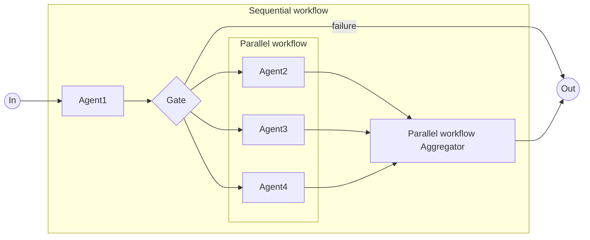

```mermaid
flowchart LR
in((In))
out((Out))
agent1[Agent1]
gate{Gate}
parallel_workflow_aggregator[Parallel workflow Aggregator]
agent2[Agent2]
agent3[Agent3]
agent4[Agent4]
subgraph parallel_workflow["Parallel workflow"]
  agent2
  agent3
  agent4
end
subgraph sequential_workflow["Sequential workflow"]
  agent1
  gate
  parallel_workflow
  parallel_workflow_aggregator
end
in --> agent1
agent1 --> gate
gate -->|failure| out
gate --> agent2
gate --> agent3
gate --> agent4
agent2 --> parallel_workflow_aggregator
parallel_workflow_aggregator --> out
agent3 --> parallel_workflow_aggregator
agent4 --> parallel_workflow_aggregator
```
