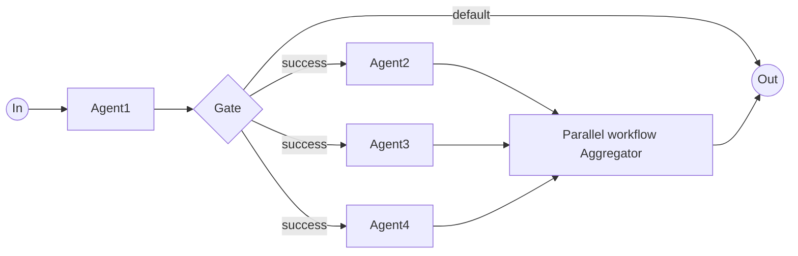

```mermaid
flowchart LR
in((In))
out((Out))
agent1[Agent1]
gate{Gate}
parallel_workflow_aggregator[Parallel workflow Aggregator]
agent2[Agent2]
agent3[Agent3]
agent4[Agent4]
in --> agent1
agent1 --> gate
gate -->|success| agent2
gate -->|success| agent3
gate -->|success| agent4
gate -->|default| out
agent2 --> parallel_workflow_aggregator
parallel_workflow_aggregator --> out
agent3 --> parallel_workflow_aggregator
agent4 --> parallel_workflow_aggregator
```
