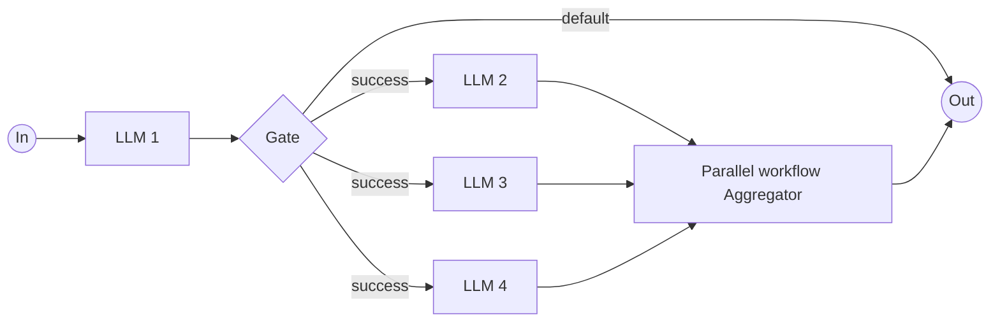

```mermaid
flowchart LR
in((In))
out((Out))
llm_1[LLM 1]
gate{Gate}
parallel_workflow_aggregator[Parallel workflow Aggregator]
llm_2[LLM 2]
llm_3[LLM 3]
llm_4[LLM 4]
in --> llm_1
llm_1 --> gate
gate -->|success| llm_2
gate -->|success| llm_3
gate -->|success| llm_4
gate -->|default| out
llm_2 --> parallel_workflow_aggregator
parallel_workflow_aggregator --> out
llm_3 --> parallel_workflow_aggregator
llm_4 --> parallel_workflow_aggregator
```
