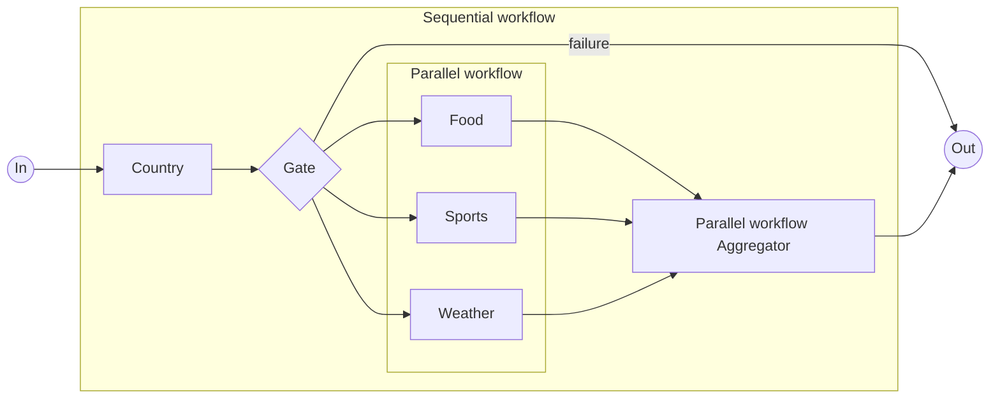

```mermaid
flowchart LR
in((In))
out((Out))
subgraph sequential_workflow["Sequential workflow"]
  country[Country]
  gate{Gate}
  subgraph parallel_workflow["Parallel workflow"]
    food[Food]
    sports[Sports]
    weather[Weather]
  end
  parallel_workflow_aggregator[Parallel workflow Aggregator]
end
in --> country
country --> gate
gate -->|failure| out
gate --> food
gate --> sports
gate --> weather
food --> parallel_workflow_aggregator
parallel_workflow_aggregator --> out
sports --> parallel_workflow_aggregator
weather --> parallel_workflow_aggregator
```
