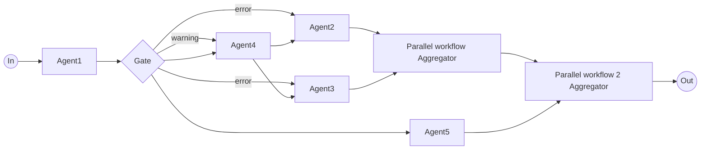

```mermaid
flowchart LR
in((In))
out((Out))
agent1[Agent1]
gate{Gate}
agent4[Agent4]
parallel_workflow_aggregator[Parallel workflow Aggregator]
agent2[Agent2]
agent3[Agent3]
parallel_workflow_2_aggregator[Parallel workflow 2 Aggregator]
agent5[Agent5]
in --> agent1
agent1 --> gate
gate -->|warning| agent4
gate -->|error| agent2
gate -->|error| agent3
gate --> agent4
gate --> agent5
agent4 --> agent2
agent4 --> agent3
agent2 --> parallel_workflow_aggregator
parallel_workflow_aggregator --> parallel_workflow_2_aggregator
agent3 --> parallel_workflow_aggregator
parallel_workflow_2_aggregator --> out
agent5 --> parallel_workflow_2_aggregator
```
