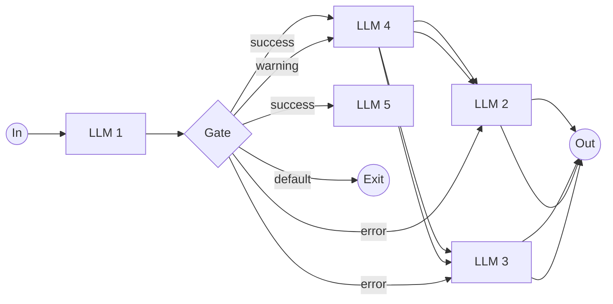

```mermaid
flowchart LR
In(("In")) -->
LLM_1["LLM 1"]
LLM_1 --> Gate
Gate{"Gate"}
LLM_4["LLM 4"]
LLM_4 --> LLM_2
LLM_4 --> LLM_3
LLM_2["LLM 2"]
LLM_3["LLM 3"]
LLM_5["LLM 5"]
Gate -->|success| LLM_4
Gate -->|success| LLM_5
LLM_4["LLM 4"]
LLM_4 --> LLM_2
LLM_4 --> LLM_3
LLM_2["LLM 2"]
LLM_3["LLM 3"]
LLM_2 --> Out(("Out"))
LLM_3 --> Out(("Out"))
Gate -->|warning| LLM_4
LLM_2["LLM 2"]
LLM_3["LLM 3"]
LLM_2 --> Out(("Out"))
LLM_3 --> Out(("Out"))
Gate -->|error| LLM_2
Gate -->|error| LLM_3
exit((Exit))
Gate -->|default| exit
```
