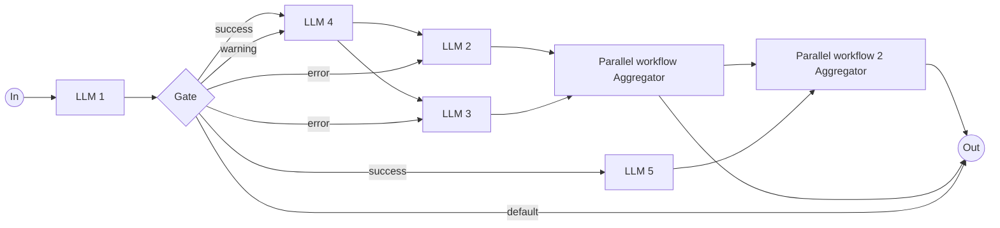

```mermaid
flowchart LR
In(("In")) -->
LLM_1["LLM 1"]
LLM_1 --> Gate
Gate{"Gate"}
LLM_4["LLM 4"]
LLM_4 --> LLM_2
LLM_4 --> LLM_3
LLM_2["LLM 2"]
LLM_3["LLM 3"]
Parallel_workflow_Parallel_workflow_Aggregator_32["Parallel workflow Aggregator"]
LLM_2 --> Parallel_workflow_Parallel_workflow_Aggregator_32
LLM_3 --> Parallel_workflow_Parallel_workflow_Aggregator_32
LLM_5["LLM 5"]
Parallel_workflow_2_Parallel_workflow_2_Aggregator_16["Parallel workflow 2 Aggregator"]
Parallel_workflow_Parallel_workflow_Aggregator_32 --> Parallel_workflow_2_Parallel_workflow_2_Aggregator_16
LLM_5 --> Parallel_workflow_2_Parallel_workflow_2_Aggregator_16
Parallel_workflow_2_Parallel_workflow_2_Aggregator_16 --> Out(("Out"))
Parallel_workflow_Parallel_workflow_Aggregator_32 --> Out(("Out"))
Gate -->|success| LLM_4
Gate -->|success| LLM_5
Gate -->|warning| LLM_4
Gate -->|error| LLM_2
Gate -->|error| LLM_3
Gate -->|default| Out(("Out"))
```
