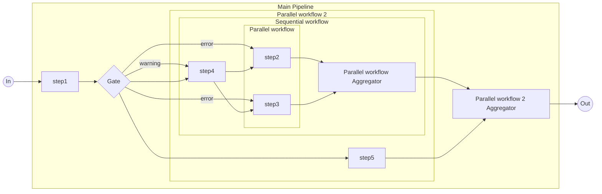

```mermaid
flowchart LR
in((In))
out((Out))
step1[step1]
gate{Gate}
step4[step4]
parallel_workflow_aggregator[Parallel workflow Aggregator]
step2[step2]
step3[step3]
parallel_workflow_2_aggregator[Parallel workflow 2 Aggregator]
step5[step5]
subgraph parallel_workflow_2["Parallel workflow 2"]
  sequential_workflow
  step5
end
subgraph parallel_workflow["Parallel workflow"]
  step2
  step3
end
subgraph sequential_workflow["Sequential workflow"]
  step4
  parallel_workflow
  parallel_workflow_aggregator
end
subgraph main_pipeline["Main Pipeline"]
  step1
  gate
  parallel_workflow_aggregator
  parallel_workflow_2
  parallel_workflow_2_aggregator
end
in --> step1
step1 --> gate
gate -->|warning| step4
gate -->|error| step2
gate -->|error| step3
gate --> step4
gate --> step5
step4 --> step2
step4 --> step3
step2 --> parallel_workflow_aggregator
parallel_workflow_aggregator --> parallel_workflow_2_aggregator
step3 --> parallel_workflow_aggregator
parallel_workflow_2_aggregator --> out
step5 --> parallel_workflow_2_aggregator
```
