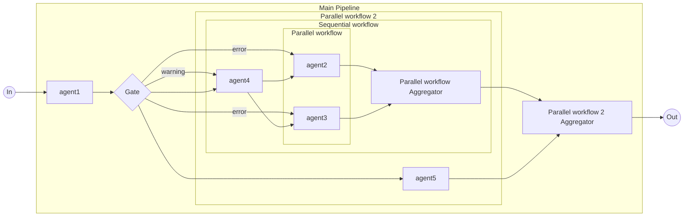

```mermaid
flowchart LR
in((In))
out((Out))
subgraph main_pipeline["Main Pipeline"]
  agent1[agent1]
  gate{Gate}
  subgraph parallel_workflow_2["Parallel workflow 2"]
    subgraph sequential_workflow["Sequential workflow"]
      agent4[agent4]
      subgraph parallel_workflow["Parallel workflow"]
        agent2[agent2]
        agent3[agent3]
      end
      parallel_workflow_aggregator[Parallel workflow Aggregator]
    end
    agent5[agent5]
  end
  parallel_workflow_2_aggregator[Parallel workflow 2 Aggregator]
end
in --> agent1
agent1 --> gate
gate -->|warning| agent4
gate -->|error| agent2
gate -->|error| agent3
gate --> agent4
gate --> agent5
agent4 --> agent2
agent4 --> agent3
agent2 --> parallel_workflow_aggregator
parallel_workflow_aggregator --> parallel_workflow_2_aggregator
agent3 --> parallel_workflow_aggregator
parallel_workflow_2_aggregator --> out
agent5 --> parallel_workflow_2_aggregator
```
