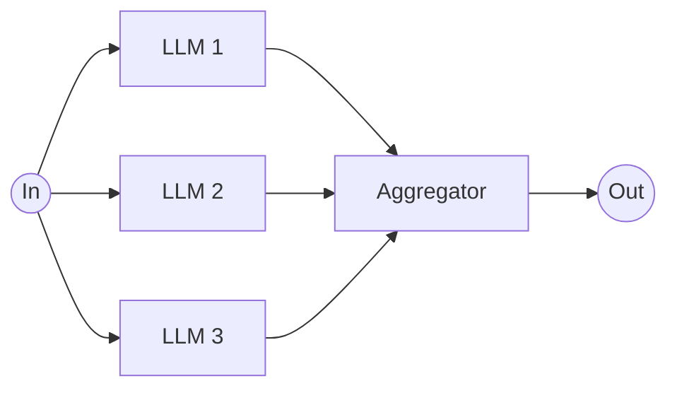

```mermaid
flowchart LR
in((In))
out((Out))
aggregator[Aggregator]
llm_1[LLM 1]
llm_2[LLM 2]
llm_3[LLM 3]
in --> llm_1
in --> llm_2
in --> llm_3
llm_1 --> aggregator
aggregator --> out
llm_2 --> aggregator
llm_3 --> aggregator
```
