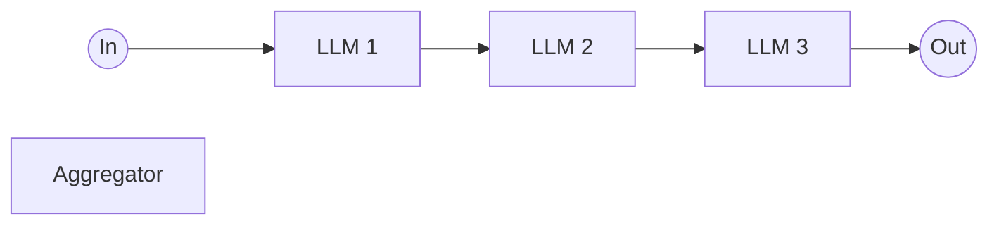

```mermaid
flowchart LR
In(("In")) -->
LLM_1["LLM 1"]
LLM_1 --> LLM_2
Aggregator["Aggregator"]
LLM_2["LLM 2"]
LLM_2 --> LLM_3
Aggregator["Aggregator"]
LLM_3["LLM 3"]
LLM_3 --> Out(("Out"))
Aggregator["Aggregator"]
```
