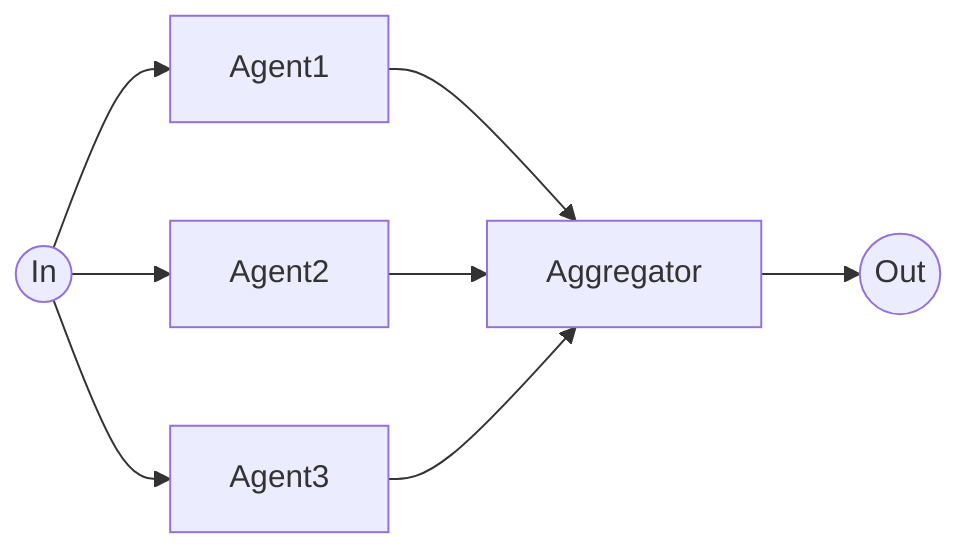

```mermaid
flowchart LR
in((In))
out((Out))
aggregator[Aggregator]
agent1[Agent1]
agent2[Agent2]
agent3[Agent3]
in --> agent1
in --> agent2
in --> agent3
agent1 --> aggregator
aggregator --> out
agent2 --> aggregator
agent3 --> aggregator
```
