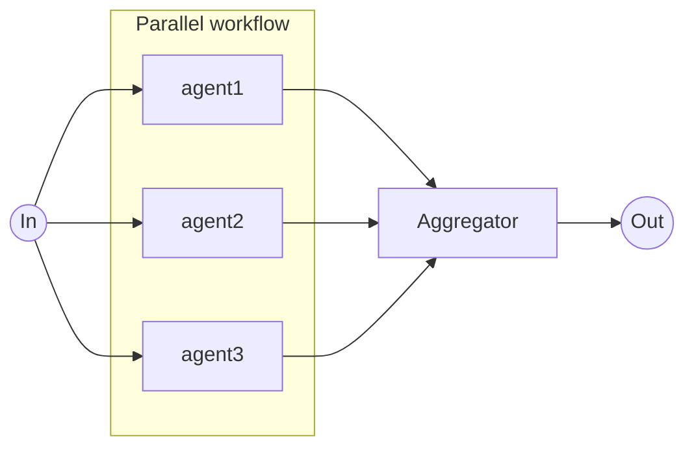

```mermaid
flowchart LR
in((In))
out((Out))
aggregator[Aggregator]
agent1[agent1]
agent2[agent2]
agent3[agent3]
subgraph parallel_workflow["Parallel workflow"]
  agent1
  agent2
  agent3
end
in --> agent1
in --> agent2
in --> agent3
agent1 --> aggregator
aggregator --> out
agent2 --> aggregator
agent3 --> aggregator
```
