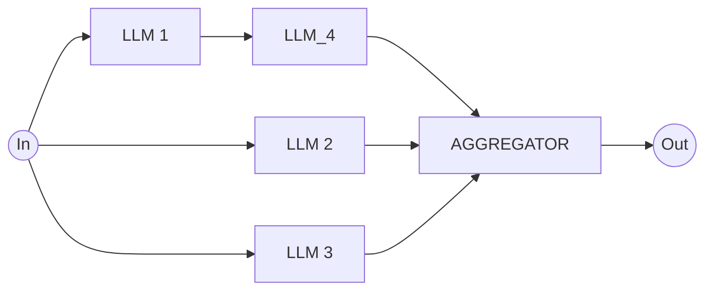

```mermaid
flowchart LR
In(("In")) -->
LLM_1["LLM 1"] & LLM_2["LLM 2"] & LLM_3["LLM 3"]
LLM_1 --> LLM_4["LLM_4"]
LLM_4 --> AGGREGATOR
LLM_2 --> AGGREGATOR
LLM_3 --> AGGREGATOR
AGGREGATOR --> Out(("Out"))
```
#

```mermaid
flowchart LR
In(("In")) --> LLM_1["LLM 1"]
In(("In")) --> LLM_2["LLM 2"]
In(("In")) --> LLM_3["LLM 3"]

LLM_1 --> LLM_4["LLM_4"]
LLM_4 --> AGGREGATOR
LLM_2 --> AGGREGATOR
LLM_3 --> AGGREGATOR
AGGREGATOR --> Out(("Out"))
```
#
