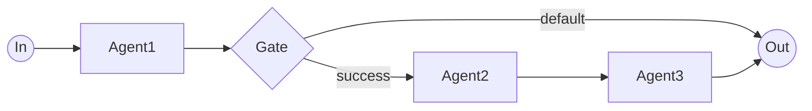

```mermaid
flowchart LR
in((In))
out((Out))
agent1[Agent1]
gate{Gate}
agent2[Agent2]
agent3[Agent3]
in --> agent1
agent1 --> gate
gate -->|success| agent2
gate -->|default| out
agent2 --> agent3
agent3 --> out
```
