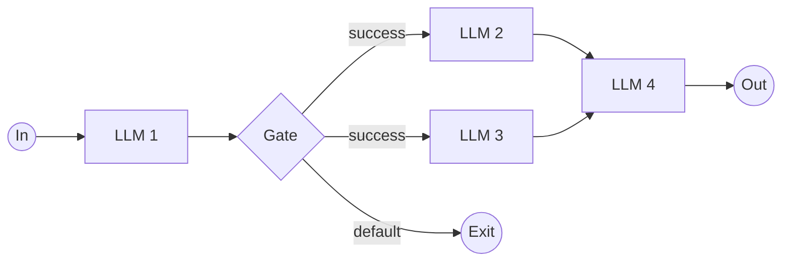

```mermaid
flowchart LR
In(("In")) -->
LLM_1["LLM 1"]
LLM_1 --> Gate
Gate{"Gate"}
LLM_2["LLM 2"]
LLM_3["LLM 3"]
LLM_2 --> LLM_4
LLM_3 --> LLM_4
LLM_4["LLM 4"]
LLM_4 --> Out(("Out"))
Gate -->|success| LLM_2
Gate -->|success| LLM_3
exit((Exit))
Gate -->|default| exit
```
