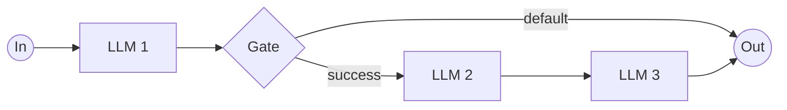

```mermaid
flowchart LR
in((In))
out((Out))
llm_1[LLM 1]
gate{Gate}
llm_2[LLM 2]
llm_3[LLM 3]
in --> llm_1
llm_1 --> gate
gate -->|success| llm_2
gate -->|default| out
llm_2 --> llm_3
llm_3 --> out
```
