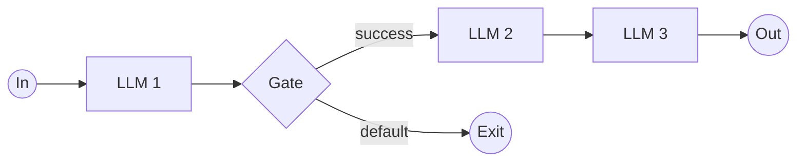

```mermaid
flowchart LR
In(("In")) --> LLM_1["LLM 1"]
LLM_1["LLM 1"]
LLM_1 --> Gate
Gate{"Gate"}
Gate -->|success| LLM_2["LLM 2"]
LLM_2["LLM 2"]
LLM_2 --> LLM_3
LLM_3["LLM 3"]
LLM_3 --> Out(("Out"))
Gate -->|default| exit((Exit))
```
