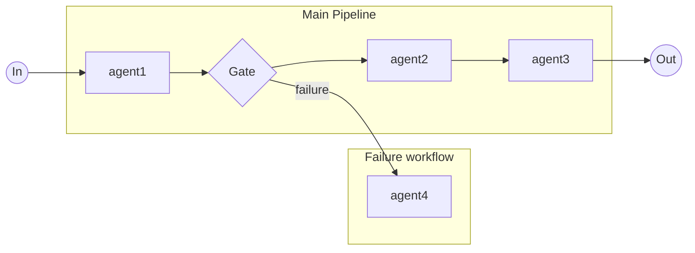

```mermaid
flowchart LR
in((In))
out((Out))
agent1[agent1]
gate{Gate}
agent4[agent4]
agent2[agent2]
agent3[agent3]
subgraph failure_workflow["Failure workflow"]
  agent4
end
subgraph main_pipeline["Main Pipeline"]
  agent1
  gate
  agent4
  agent2
  agent3
end
in --> agent1
agent1 --> gate
gate -->|failure| agent4
gate --> agent2
agent2 --> agent3
agent3 --> out
```
