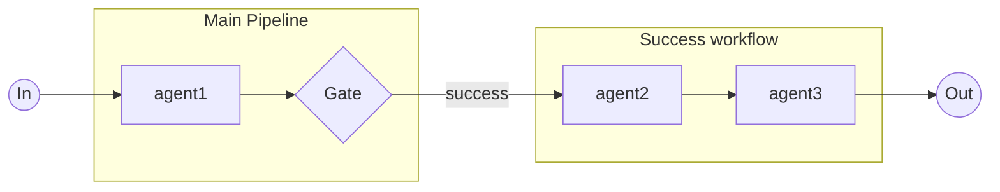

```mermaid
flowchart LR
in((In))
out((Out))
subgraph main_pipeline["Main Pipeline"]
  agent1[agent1]
  gate{Gate}
end
subgraph success_workflow["Success workflow"]
  agent2[agent2]
  agent3[agent3]
end
in --> agent1
agent1 --> gate
gate -->|success| agent2
agent2 --> agent3
agent3 --> out
```
